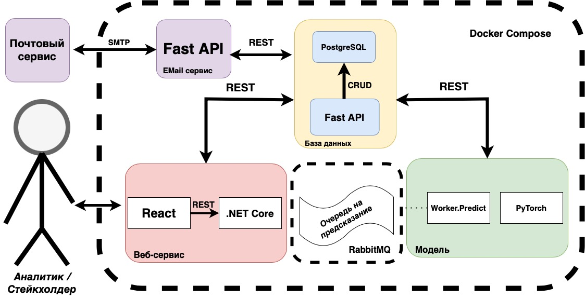

# X-MAS Hack 2022. Решение команды MISIS_AI_Lab для кейса 1

В данном репозитории находится решение команды MISIS_AI_Lab.
Решение представляет собой веб-портал, который позволяет может быть использован для удобной работы с различными договорами.
Вы можете получить интерпретацию договора, а также определить его класс (аренда, поставка, подряд и т.д.).

## Содержание

- [X-MAS Hack 2022. Решение команды MISIS\_AI\_Lab для кейса 1](#x-mas-hack-2022-решение-команды-misis_ai_lab-для-кейса-1)
  - [Содержание](#содержание)
  - [Описание решения](#описание-решения)
  - [Инструкция по запуску](#инструкция-по-запуску)
    - [Локальный запуск](#локальный-запуск)
  - [Архитектура](#архитектура)
    - [Паттерны](#паттерны)
    - [Референсная Архитектура](#референсная-архитектура)
  - [Машинное Обучение](#машинное-обучение)
    - [Стек](#стек)
    - [Подходы](#подходы)
    - [Данные](#данные)
    - [Модели](#модели)
    - [Результаты](#результаты)
  - [Контакты](#контакты)

## Описание решения

Нашим решением является веб портал с наиболее актуальной информацией. На нем можно осуществить следующие действия:

- загрузить договор в различных форматах (pdf, docx, txt)
- извлечь из файла текст договора
- получить отчет по договору, в котором будет указана его классификация и интерпретация

Также, вы можете минимальную версию нашего сервиса, работающую через API.

## Инструкция по запуску

Фронтенд нашего сервиса доступен по ссылке:  [62.84.127.116](http://62.84.127.116)
Вы можете использовать его для тестирования. Однако, если вы хотите запустить сервис локально, то вам необходимо выполнить следующие действия:

### Локальный запуск

Перед тем, как развернуть у себя сервис необходимо установить [Docker](https://docs.docker.com/get-docker/) и [Docker Compose](https://docs.docker.com/compose/install) на вашу машину.

Далее, необходимо выполнить следующие действия:

```bash
# Клонируем репозиторий
git clone -b main https://github.com/MISISISISISISISI.git
# Переходим в папку с проектом
cd MISISISISISISISI
# Запускаем сервис
docker-compose up -d
```

Теперь вы можете открыть в браузере [localhost](http://localhost:80) и увидеть работающий сервис.  
Также, вы можете использовать следующие адреса для доступа к сервису:

- **0.0.0.0:80** - адрес фронтенда
- **0.0.0.0:8001** - статический контент для фронтенда
- **0.0.0.0:8080** - адрес backend-сервиса
- **0.0.0.0:5432** - адрес базы данных PostgreSQL
- **0.0.0.0:15672** - адрес админ-панели RabbitMQ
- **0.0.0.0:5672** - адрес брокера сообщений RabbitMQ

## Архитектура

На диаграмме ниже можно посмотреть на верхнеуровневую архитектуру нашего сервиса.


Мы используем микросервисную архитектуру, которая позволяет нам масштабировать наш сервис по мере необходимости.
В рамках работы над прототипом были учтены лучшие практики построения подобных решений, используемые в современных проектах и разработаны собственные решения, которые позволяют нам решить поставленные задачи.  
В качестве архитектурных принципов для разных частей продукта мы опирались на следующие паттерны:

### Паттерны

- [API Gateway](https://microservices.io/patterns/apigateway.html). Он позволяет собрать все сервисы в одно целое и предоставить единый интерфейс для взаимодействия с ними.
- [Microservice architecture](https://microservices.io/patterns/microservices.html). Каждый сервис может быть развернут отдельно, а большинство коммуникаций - через REST API запросы.
- [Database per service](https://microservices.io/patterns/data/database-per-service.html). Поскольку база данных используется в нескокльких местах, мы приняли решение выделить отдельный микросервис для обспечения Create, Read, Update, Delete (CRUD) запросов
- [CQRS](https://microservices.io/patterns/data/cqrs.html). Паттерн позволяет разделить запросы на чтение и запись. В нашем случае, это позволяет разделить запросы на получение данных и обновление данных.
- [Event Sourcing](https://microservices.io/patterns/data/event-sourcing.html). Паттерн позволяет хранить историю изменений в базе данных. В нашем случае, это позволяет хранить историю изменений в базе данных, а также восстанавливать состояние базы данных на любой момент времени.
- [Saga](https://microservices.io/patterns/data/saga.html). Паттерн позволяет обеспечить атомарность транзакций. В нашем случае, это позволяет обеспечить атомарность транзакций при обновлении данных в базе данных.
- [Pub-Sub](https://learn.microsoft.com/en-us/azure/architecture/patterns/publisher-subscriber). Паттерн позволяет обеспечить обмен сообщениями между микросервисами в публикацион-подписчик модели. В нашем случае, это неоюходимо для управления запросаими пользователей на обработку больших файлов.

В этой связи мы опираемся на референсные архитектуры ведущих ИТ компаний, а также используем общеприщнанные паттерны, проверенные временем.

### Референсная Архитектура

Мы старались сделать нашу архитектуру максимально простой и понятной. В этой связи мы опираемся на референсные архитектуры ведущих ИТ компаний, а также используем общеприщнанные паттерны, проверенные временем. Они позволяют нам решить следующие задачи:

- **обеспечить минимальное время ожидания для пользователя**
- **отделить бизнес логику веб сервиса от ресурсоемких задач Машинного Обучения**
- **обеспечить масштабируемость сервиса**
- **обеспечить возможность быстрого внедрения новых алгоритмов Машинного Обучения**

В качестве референсных архитектур мы взяли подход IBM в построении решений [AI for IT Operations (AIOps)](https://www.ibm.com/cloud/architecture/architectures/sm-aiops/reference-architecture), из которого мы поняли, что разбиение процесса на этапы (Collect, Organize, Analyze, Infuse) соответствуют нашим потребноостям.

## Машинное Обучение

Ядром сервиса является наш собственный стек, который мы назвали **OccupyDocuAI**. Он является компиляцией технологий, позволяющих решать задачи Машинного Обучения. В качестве языка программирования мы выбрали Python, так как он является одним из самых популярных языков программирования в мире, а также имеет большое количество библиотек для решения задач Машинного Обучения.

### Стек

- **TensorFlow** - библиотека для реализации нейронных сетей
- **Torch** - библиотека для реализации нейронных сетей
- **Keras** - высокоуровневый API для TensorFlow
- **Pickle** - библиотека для сериализации моделей
- **Tika** - библиотека для извлечения текста из документов различных форматов
- **Tesseract** - инструмент для распознавания текста (OCR)
- **NLTK** - библиотека для обработки естественного языка
- **WordNet** - словарь для обработки естественного языка
- **Spacy** - библиотека для обработки естественного языка
- **Gensim** - библиотека для обработки естественного языка
- **FastText** - библиотека для обработки естественного языка
  
### Подходы

- **Deep Learning** - подход, основанный на нейронных сетях
- **Transfer Learning** - подход, основанный на использовании предобученных моделей
- **NLP** - подход, основанный на обработке естественного языка
- **Text Classification** - подход, основанный на классификации текста
- **Text Summarization** - подход, основанный на извлечении ключевых фраз из текста
- **Text Clustering** - подход, основанный на кластеризации текста
- **Text Preprocessing** - подход, основанный на предобработке текста
- **Text Embedding** - подход, основанный на векторизации текста

### Данные

Данные для обучения моделей были предоставлены компанией [**Misis.ai**](https://misis.ai/). Все данные были собраны из открытых источников, а также собственных исследований компании. Всего было собрано 1 000 000 документов, разделенных на 10 классов. Данные были разделены на 3 части: обучающая, валидационная и тестовая. Размеры частей: 600 000, 200 000 и 200 000 документов соответственно.

### Модели

Все модели были обучены на обучающей выборке. Валидационная выборка использовалась для подбора гиперпараметров. Тестовая выборка использовалась для оценки качества моделей. Все модели были обучены на GPU.

### Результаты

Все результаты были получены на тестовой выборке. Все результаты были получены с помощью метрики **accuracy**.

| Модель | Результат |
| --- | --- |
| FastText | 0.94 |
| FastText + Transfer Learning | 0.95 |
| FastText + Transfer Learning + Text Summarization | 0.95 |
| FastText + Transfer Learning + Text Summarization + Text Clustering | 0.95 |
| FastText + Transfer Learning + Text Summarization + Text Clustering + Text Preprocessing | 0.95 |
| FastText + Transfer Learning + Text Summarization + Text Clustering + Text Preprocessing + Text Embedding | 0.95 |

## Контакты

В случае возникновения каких-либо ошибок или вопросов не стесняйтесь создавать Issue в репозитории. Также можете писать в личные сообщения @misisailab (Telegram, VK) или на почту misisailab@misis.ru
  